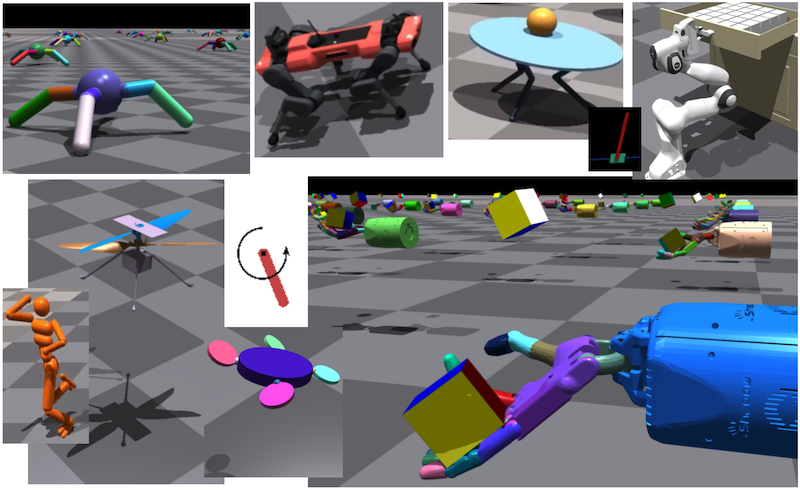

# BayesSimIG: Scalable Parameter Inference for Adaptive Domain Randomization with Isaac Gym

**Table of Contents:**<br />
[Overview](#overview)<br />
[Installation](#install)<br />
[A walk-through of the TensorBoard Output](#tb)<br />
[BayesSim with IsaacGym Environments/Tasks](#bsimig)<br />
[Yaml configs](#yaml)<br />
[More Info (Headless Mode, CPU/GPU)](#more)<br />
[Advanced: Differentiable Path Signatures](#advanced)<br />
[References](#ref)<br />


-----------------------------------------------------------
<a name="overview"></a>
## BayesSimIG Overview

BayesSim is a likelihood-free inference framework [1]. 
This repo contains a pytorch implementation of BayesSim and 
the integration with NVIDIA Isaac Gym environments. 
This combination allows large-scale parameter
inference with end-to-end GPU acceleration (both inference and 
simulation get GPU speedup).


The instructions below show how to install and run BayesSim and how to 
enable adaptive domain randomization for Isaac Gym environments.

-----------------------------------------------------------
<a name="install"></a>
## Installation

Optional initial step: create a new conda environment with
`conda create --name bsim python=3.8` and activate it with
`conda activate bsim`. Conda is not strictly needed; 
alternatives like virtualenv can be used; 
a direct install without using virtual environments is ok as well.

### Step 1: Download and install IsaacGym (IG)

Download Isaac Gym (IG) from https://developer.nvidia.com/isaac-gym
and follow the installation instructions in IG documentation.
A copy/paste example of IG install (after `IsaacGym_Preview_2_Package.tar.gz`
downloading `IsaacGym_Preview_2_Package.tar.gz`:
```
cd ~/code/  # path where you put the downloaded code
tar -xvzf IsaacGym_Preview_2_Package.tar.gz
cd isaacgym/python/
pip install -e .
```
IG works on a variety of platforms, but if you face any issues -
please refer to IG documentation for troubleshooting.
Ultimately, you should be able to run IG examples, e.g.:
```
cd isaacgym/python/examples
python franka_cube_ik.py
```

### Step 2: Install BayesSimIG

Clone this repo (e.g. into `~/code/` directory), then install:
```
cd ~/code/bayes-sim-ig
pip install -e .
```
Set environment variable for Isaac Gym, so that BayesSimIG can find
IG assets:
```
export ISAACGYM_PATH=~/code/isaacgym
```

-----------------------------------------------------------
<a name="tb"></a>
## A walk-through of the BayesSimIG TensorBoard Output

You can start running BayesSim with a simple Pendulum example:
```
export ISAACGYM_PATH=~/code/isaacgym &&
python -m bayes_sim_ig.bayes_sim_main --task Pendulum \
  --logdir /tmp/bsim/ --max_iterations 100 --seed 0 --headless
```

Then you can launch Tensorboard to see the results:
```
tensorboard --logdir=/tmp/bsim/ --bind_all --port 6006 \
  --samples_per_plugin images=1000
```

The posteriors are visualized in the `IMAGES` tensorboard tab:


On the left sidebar you will see the runs with descriptive names.
In this example: `Pendulum_MDNN_ftune1000_summary_start_policy_random_nreal1_seed0`

The format is:
`[Task]_[BayesSim NN type]_[summarizer name]_[sampling policy]_seed[N]`

The `SCALARS` tab will contain plots with training/test losses and RL training
statistics. Below is an example of RL reward plots for iterations 0,1,4.
In iteration 0 we train RL on environments whose physics parameters are sampled
from a uniform distribution. The red line shows RL reward curve during training.
The name for RL will appear as an iteration/run with the name 
`Pendulum_MDNN_ftune1000_summary_corrdiff_policy_random_nreal1_seed0/rl_0`.

Next, we fit BayesSim posterior on dataset of short trajectories sampled
from the environments with randomized parameters. Then we train RL from
scratch on environments whose parameters are sampled from the BayesSim
posterior distribution (instead of sampling randomly).
The orange line shows RL reward curve during training.
The name for RL will appear as an iteration/run with the name 
`Pendulum_MDNN_ftune1000_summary_corrdiff_policy_random_nreal1_seed0/rl_1`.

Next, we continue training BayesSim posterior further using more short
trajectories. Then we again train RL from scratch to see if RL training
proceeds better/faster when environment parameters are sampled from the
updated BayesSim posterior. And so on.

Since we illustrated BayesSim posterior from iteration 4 above, below we
also show the results of RL training at this iteration (green line on the
`Train/mean_reward` plot; Tensorboard run for this is named
`Pendulum_MDNN_ftune1000_summary_corrdiff_policy_random_nreal1_seed0/rl_4`.


While BayesSim is trained on the data collected from simulation, obtaining
the posterior requires conditioning on a trajectory that comes from a
real experiment. Here we will have a surrogate real environment. These
surrogate real parameters are labelled `True value` and indicated by a thin
red line in the posterior plots. These values are not known to BayesSim
or course. BayesSim only gets one trajectory from the environment that is
initialized with these parameters (i.e. a trajectory of the pendulum
with length 0.5 and mass 1.0). In addition to visualizing the posterior
we can also evaluate RL that has been trained using BayesSim posterior.
This evaluation will appear in the `SurrogateReal` section of the plots.


-----------------------------------------------------------
<a name="bsimig"></a>
## Examples with IsaacGym Environments

BayesSimIG supports IG environments/tasks that have been released 
with the 2021 Isaac Gym version, namely:
`Ant`, `Anymal`, `BallBalance`, `Cartpole`, `FrankaCabinet`,
`Humanoid`, `Ingenuity`, `Quadcoper`, `ShadowHand`.



### ShadowHand Example

Below is an example of running BayesSim and initial stages of RL
on the ShadowHand task.

```
export ISAACGYM_PATH=~/code/isaacgym &&
python -m bayes_sim_ig.bayes_sim_main --task ShadowHand \
  --logdir /tmp/bsim/ --max_iterations 1000 --seed 0 --headless 
```

In this example BayesSim performed inference for 32 parameters of the ShadowHand.
The posterior after 9th iteration of BayesSim is visualized below.
A subset of 6 parameters is shown: scale and mass of the cube object,
stiffness a hand's tendon (t_FFJ1c), mass of the distal phalanx
of the thumb (thdistal).


The plots below demonstrate that RL training can benefit from BayesSim 
posterior, and a higher surrogate real reward can be achieved, 
compared to learning with uninformed domain randomization.
The orange line in the first plot below indicates per-step rewards during
RL training on environments with parameters drawn from a uniform prior.
The blue line indicates rewards when training on environments that draw
parameters from the posterior of the 9th iteration of BayesSim.
The second plot shows surrogate real rewards when evaluating the resulting RL
policies on an environment whose parameters are initialized to 'true' values.
These 'true' parameter values are not known to BayesSim or RL of course.
They are chosen to be the surrogates for parameters of a real hand and cube
in lieu of setting up experiments on real hardware.


-----------------------------------------------------------
<a name="yaml"></a>
## Customization and Yaml Configs

The documentation for the main command-line arguments of 
`bayes_sim_ig.bayes_sim_main` can be found in 
`isaacgym/docs/examples/rl.html`, since `bayes_sim_main.py` retains
a similar format for the arguments as IG training launch script
`isaacgym/python/rlgpu/train.py`, with minor modifications.

They key useful flags/arguments are:
```
--help
    Prints out commandline options
--task
    Select example task to run. Options are: Ant, Anymal, BallBalance, 
    Cartpole, Humanoid, Ingenuity, FrankaCabinet, Quadcopter, ShadowHand.
--headless
    Run task without viewer.
--logdir
    Directory to place log files for training. Default is **logs/**.
--sim_device
    Choose the device for running the simulation with PyTorch-like syntax.
    Can be **cpu** or **cuda**, with an optional device specification. 
    Default is **cuda:0**.
--rl_device
    Choose device for running RL training. Default is **cuda:0**.
--seed
    Set a random seed. Set -1 to randomly generate a seed.
--max_iterations
    Overrides maximum number of PPO training iterations from config file.
--num_envs
    Overrides number of environments from config file.
```

See `isaacgym/docs/examples/rl.html` for more details.

The aspects that are specific to BayesSim are outlined in the custom
sections of the yaml configuration files, which are described below.

`bayes_sim_ig/cfg` directory contains yaml config files for the IG tasks.
By default, BayesSimIG code will use these configs. They are composed
in the same format at those within IG in `isaacgym/python/rlgpu/tasks/cfg/`.

The configs also contain `BayesSim` section that allows to customize BayesSim
parameters. For example:
```
bayessim:
  modelClass: MDNN   # 'MDNN' or 'MDRFF' 
  trainTrajs: 10000  # number of training trajs to collect for BayesSim training
  trainTrajLen: 20   # train on short trajectories with this maximum length
  trainUpdates: 1000     # number of gradient updates for 1st BayesSim iteration
  finetuneUpdates: 1000  # num. grad. updates for further BayesSim iterations
  trainBatchSize: 5000   # batch size for BayesSim training
  components: 10         # number of components in the posterior mixture
  hiddenLayers: [128, 128]           # size of hidden layers for BayesSim NN
  lr: 5.e-4                          # optimizer learning rate for BayesSim
  summarizerFxn: 'summary_corrdiff'  # function to make trajectory summaries
  collectPolicy: 'policy_random'     # policy for getting BayesSim training data
  realEvals: 100     # number of surrogate 'real' test episodes (only for eval)
  realTrajs: 1       # number of episodes to run on real hardware per iteration
  realIters: 100     # maximum number of BayesSim iterations
  ftuneRL: False     # fine-tune or re-start RL after each BayesSim iteration
```

Environment/task parameters that can be randomized are described in
`isaacgym/docs/rl/domainrandomization.html`. Yaml configs contain 
`task` section that specifies randomization ranges for all the parameter 
groups that will be randomized. For example, for the Ant environment/task
the default BayesSimIG randomization config is:
```
task:
  randomize: True
  randomization_params:
    actor_params:
      ant:
        color: True
        rigid_body_properties:
          mass:
            range: [0.01, 5.0]
            operation: "scaling"
            distribution: "uniform"
            schedule: "constant"
            schedule_steps: 0
        dof_properties:
          stiffness:
            range: [0.01, 20.0]
            operation: "additive"
            distribution: "uniform"
            schedule: "constant"
            schedule_steps: 0
```

Configs for RL training are loaded from 
`isaacgym/python/rlgpu/tasks/cfg/train/`.

You can provide a custom yaml config with `--cfg_env [your_path]` and custom
RL training config as `--cfg_train [your_path]`.

Example for the `Ant` environment:

```
python -m bayes_sim_ig.bayes_sim_main --task Ant \
  --cfg_env /tmp/custom_ant.yaml \
  --cfg_train /tmp/custom_ant_rl.yaml \
  --logdir /tmp/bsim/ --max_iterations 20 --seed 0 --headless 
```

The contents of the yaml configs and all other command-line arguments will be 
printed as output in the `TEXT` tab in Tensorboard:


-----------------------------------------------------------
<a name="more"></a>
## Additional Information (Headless Mode, CPU/GPU Device)

If you would like to run Pendulum in `headless` mode on a server/remote
machine without display, then you would need to  redirect output to a
virtual display for visualization:
```
apt-get install xvfb
Xvfb :1 -screen 0 1024x768x16 &
export DISPLAY=:1 && python -m bayes_sim_ig.bayes_sim_main \
  --task Pendulum  --logdir /tmp/bsim/ --max_iterations 20
```
This is because Pendulum is a task ported to IG from OpenAI Gym, and
hence uses a simple non-IG rendering.

The rest of the native IG tasks can be run with `--headless` flag
without any additional setup on a remote machine without display.

If you have multiple GPUs on your machine, you can specify GPU device
ID with: `--rl_device cuda:2 --sim_device cuda:2` (to run on GPU with
device ID 2, for example).

If you would like to place the training (for BayesSim and RL) on CPU
instead of GPU you can add `--rl_device cpu`.
To place simulation on CPU use `--sim_device cpu`.


-----------------------------------------------------------
<a name="advanced"></a>
## Advanced: Differentiable Path Signatures

BayesSimIG supports experimentation with advanced ways to process trajectory 
data before training the core BayesSim networks. Users can set `signatory` 
as the summarizer function in the config to use differentiable path signatures 
as a way to summarize trajectory data:
```
bayessim:
  ...
  summarizerFxn: 'summary_signatory_batch'  # function to process summaries
```

This functionality is available via intergation with the Signatory library [2].
To install this library run:
```
git clone https://github.com/patrick-kidger/signatory.git
cd signatory && python setup.py install
```

Path signatures (or signature transforms) allow extracting features using 
principled methods from path theory. These can guarantee useful properties, 
such as invariance under time reparameterization, and ability to extend 
trajectories by combining signatures (without re-computing signatures from scratch). 
The fact that these objects are differentiable allows backpropagating through 
the summarizers, making it a novel and interesting avenue for further experiments
with adaptive representations for sequential data.


-----------------------------------------------------------
<a name="ref"></a>
## References

If you found this repository helpful, please cite:
```
@article{bayes-sim-ig,
author = {Rika Antonova, Fabio Ramos, Rafael Possas, Dieter Fox},
title = {BayesSimIG: Scalable Parameter Inference for Adaptive Domain Randomization with Isaac Gym},
booktitle = {arXiv preprint TODO.TODO},
year = {2021},
}
```

For more information about BayesSim, please refer to:

    [1] Fabio Ramos, Rafael Possas, and Dieter Fox. BayesSim: 
    Adaptive Domain Randomization Via Probabilistic Inference for robotics simulators.
    In Robotics: Science and Systems (RSS), 2019.

For more information about differentiable path signatures, please refer to:

    [2] Patrick Kidger, Terry Lyons. Signatory: Differentiable Computations 
    of the Signature and Logsignature Transforms, on both CPU and GPU.
    International Conference on Learning Representations (ICLR) 2021.
